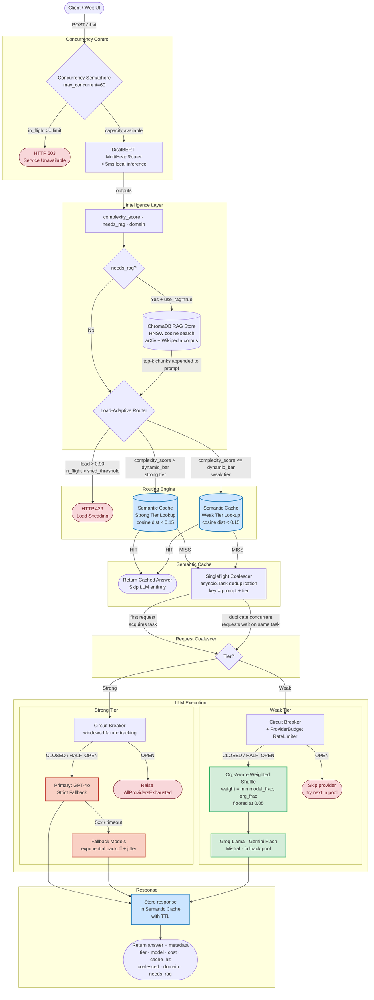

# 🚀 TriageLLM: Load-Aware, Resilient AI Gateway


A production-grade, highly concurrent API gateway that intelligently routes Large Language Model (LLM) requests between "strong" (e.g., GPT-4o, Gemini 1.5 Pro) and "weak" (e.g., Llama-3, Gemini Flash) model tiers. 

By evaluating prompt complexity in real-time (< 5ms local inference) and orchestrating a suite of resilience middleware, this gateway delivers **~60% baseline cost savings during normal operation, scaling up to 95%+ savings under extreme burst load** as dynamic load shedding and semantic caching absorb the traffic spikes.

Built to mirror the exact AI infrastructure patterns used at companies like Uber, Netflix, and Google.

## System Architecture

The gateway sits between client applications and downstream LLM providers. It normalizes the API surface and intercepts requests to apply complexity scoring, RAG retrieval, semantic caching, request coalescing, and fail-fast load shedding.




### The 6-Step Request Pipeline

1. **Multi-Head Complexity Scoring**: A custom, locally fine-tuned DistilBERT model scores the raw prompt simultaneously for `complexity`, `domain`, and `needs_rag` in under 5ms.
2. **Conditional RAG**: If the classifier detects the prompt needs external context, the gateway queries a ChromaDB vector store. If not, it skips retrieval entirely, saving precious milliseconds.
3. **Load-Adaptive Routing**: The router makes a `strong` vs `weak` decision based on the complexity score. Under heavy system load, it dynamically raises the complexity bar (fail-fast load shedding) to aggressively downgrade requests and protect P95 tail latencies.
4. **Semantic Caching**: Powered by ChromaDB using HNSW vector indexing. Instead of relying on exact-match string hashing, it returns cached answers for *semantically similar* queries (cosine distance < 0.15).
5. **Request Coalescing (Singleflight)**: Prevents the "thundering herd" problem. If 10 users ask the same un-cached question simultaneously, the gateway halts 9 of them via `asyncio.Task` shielding, queries the LLM exactly once, and broadcasts the single response to all 10 clients.
6. **Resilient Execution**: Upstream calls are guarded by windowed Circuit Breakers (with jittered half-open probes to prevent secondary thundering herds). Weak models are selected via an org-aware weighted shuffle to prevent phantom capacity routing on shared quotas (like Groq).

## The Intelligence Layer: Custom Multi-Head DistilBERT

Instead of relying on a slow, expensive "LLM-as-a-Judge" to route prompts, this gateway uses a custom PyTorch model built on `distilbert-base-uncased`. 

The model was fine-tuned using a Grid Search (Batch Size, LR, Weight Decay, Dropout) on a 2,000-prompt labeled dataset. It features a custom `MultiHeadRouter` architecture that predicts three targets from a single pass:
1. **Complexity Score (Sigmoid)**: Used by the router to determine tier.
2. **RAG Requirement (Sigmoid)**: Determines if external context should be fetched.
3. **Domain Classification (Softmax)**: Categorizes the prompt into one of 10 domains (e.g., `coding`, `business`, `system_design`) to dynamically select the most optimal System Prompt.

**Multi-Axis Accuracy (vs. GPT-4 Labeled Ground Truth):**
- Domain Detection: **83.6%**
- RAG Skipping: **79.5%**
- Tier Routing: **69.9%** 

## Performance, Cost & Survivability Benchmarks

The system was evaluated using `eval/load_test.py`, firing concurrent traffic against both the Adaptive Router and a standard Baseline (which simulates a naive app that always queries the strong model).

*Traffic included a deterministic 20% duplicate ratio to test caching and coalescing under real-world conditions.*

### 1. Burst Survivability Under Overload

The gateway is configured with a hard capacity ceiling of `max_concurrent_requests = 60`. The most significant result in the evaluation is at **N=80 — 133% of that capacity**. A standard application would experience cascading failures or multi-minute tail latencies at this level. The gateway absorbed the burst without dropping a single request, serving all 80 users at an average latency of **2,782 ms**.

The mechanism behind this is the middleware stack's ability to prevent traffic from reaching the LLM layer entirely. At N=80, **81% of requests were resolved before hitting any model** — 58 from the semantic cache and 7 via request coalescing — leaving only 15 queries to be executed against the LLM pool.

| Concurrency | Total Requests | Cache Hits | Coalesced | **LLM Calls Made** |
|---:|---:|---:|---:|---:|
| **10** | 10 | 0 | 3 | **7** |
| **30** | 30 | 9 | 7 | **14** |
| **60** | 60 | 29 | 9 | **22** |
| **80** | 80 | 58 | 7 | **15** |

### 2. Cost & Latency vs. Baseline

At normal concurrency (N=10 to N=30), the gateway delivers a consistent **~58% cost reduction** from DistilBERT-driven tier routing alone. As concurrency scales and the cache warm-up takes effect, savings compound further.

| Concurrency | Avg Latency (Router) | Avg Latency (Baseline) | Latency Drop | Cost (Router) | Cost (Baseline) | Cost Savings |
|---:|---:|---:|---:|---:|---:|---:|
| **10** | 7,143 ms | 14,685 ms | **-51%** | $0.0326 | $0.0778 | **-58.0%** |
| **30** | 7,669 ms | 19,683 ms | **-61%** | $0.1223 | $0.2924 | **-58.2%** |
| **60** | 13,201 ms | 28,259 ms | **-53%** | $0.1477 | $0.8669 | **-83.0%** |
| **80** | 2,782 ms | 27,375 ms | **-90%** | $0.0325 | $1.0484 | **-96.9%** |


### 3. Key Design Decisions

*   **Free-Tier Resilience & Org-Aware Routing**: While the strong tier utilized a paid commercial model, the weak tier relied on free-tier providers (like Groq) which impose extremely strict, org-wide rate limits (e.g., 30 Requests Per Minute). This hard constraint drove the development of the **Org-Aware Weighted Shuffle** load balancer and the `ProviderBudget` rate-limiter, enabling the gateway to gracefully spill overflow traffic to fallback models before triggering `429 Too Many Requests` errors.
*   **Tier-Aware Semantic Caching**: The cache lookup deliberately occurs after the concurrency semaphore and router logic. This ensures that weak-tier prompts cannot accidentally retrieve strong-tier cached answers, preserving strict tier boundaries for cached responses.
*   **Factual Request Coalescing**: The singleflight coalescer collapses identical concurrent requests using the raw prompt and tier as the cache key. This optimizes for highly deterministic factual queries (e.g., knowledge base lookups) by returning the exact same response to all concurrent users.
*   **In-Memory Gateway State**: Circuit breakers, rate limiters, and the request coalescer operate using fast, in-memory state primitives (like `asyncio.Lock` and `deque`) to minimize latency overhead, ensuring routing decisions complete in milliseconds.

## Installation & Deployment

This project uses Docker to ensure environment consistency and handles tricky dependencies (like PyTorch and ChromaDB's SQLite C-extensions) automatically. 

### Prerequisites
1. **Docker Desktop**: You must have [Docker](https://www.docker.com/) installed and the Docker daemon actively running on your machine.
2. **Provider API Keys**: You will need API keys for your preferred LLM providers (e.g., OpenAI for the strong tier, Groq for the free weak tier).

### 1. Environment Setup
Clone the repository and set up your environment variables. We use a `.env` file to securely inject API keys and routing thresholds.

```bash
git clone https://github.com/your-username/adaptive-rag-router.git
cd adaptive-rag-router
cp .env.example .env
```
*Note: Open the `.env` file and insert your actual API keys. The `.env.example` file is intentionally pre-configured with generic model names (like `gpt-4o`) to protect cloud provider privacy.*

### 2. Data Ingestion (Conditional RAG)
Before starting the server, you need to populate the local ChromaDB vector store. This script automatically fetches ~500 recent Machine Learning paper abstracts from the arXiv API and ~2,000 passages from a HuggingFace Wikipedia dataset.

```bash
# We recommend doing this inside a virtual environment if running locally
pip install -r requirements.txt
python scripts/ingest_rag_data.py
```
*Note: The script checks if the database is already populated and will safely exit if it is.*

### 3. Start the Gateway Server
We highly recommend running the server via Docker Compose. The `docker-compose.yml` mounts the ChromaDB databases as named volumes to persist state and applies specific environment variables (`TOKENIZERS_PARALLELISM=false`) to prevent thread deadlocks on macOS/Linux. The Dockerfile is also explicitly optimized to pull the **CPU-only PyTorch wheel**, preventing 3GB of unnecessary CUDA bloat on the gateway server.

Run the following command:
```bash
docker-compose up --build
```
The FastAPI gateway will start and bind to `http://localhost:8000`.

## Usage & API Reference

The project includes a built-in web frontend and several API endpoints.

### The Web Frontend
Once the server is running, simply open your browser to `http://localhost:8000/static/index.html`. This provides a beautiful UI to chat with the gateway and instantly see which tier it routed you to, how long it took, and how much it cost.

### `POST /chat`
The primary API endpoint. The request is intercepted, classified, and routed through the entire middleware stack.

**Request:**
```json
{
  "prompt": "What is the difference between an inner join and an outer join?",
  "use_rag": true
}
```
*Note on `use_rag`: The `use_rag: true` flag in the payload gives the gateway permission to use RAG. However, the final decision is still made by the DistilBERT classifier. The gateway will only execute a vector search if `use_rag` is true AND the ML model scores the prompt as needing external context.*

**Response:**
```json
{
  "answer": "An inner join returns only the rows that have matching values in both tables...",
  "metadata": {
    "routing": {
      "tier": "weak",
      "model_used": "groq/openai/gpt-oss-20b",
      "reason": "complexity 0.12 < bar 0.55 (load 0.05): cheap tier is sufficient",
      "load_fraction": 0.05,
      "groq_usage": 0.33
    },
    "classifier": {
      "classifier_type": "multi_head_router",
      "complexity_logit": -1.98,
      "rag_logit": -2.45
    },
    "domain": "coding",
    "needs_rag": false,
    "cache_hit": false,
    "coalesced": false,
    "usage": {
      "prompt_tokens": 45,
      "completion_tokens": 120,
      "cost_usd": 0.0001
    }
  }
}
```

### `POST /chat_baseline`
A benchmarking endpoint used strictly for load testing. It bypasses all intelligence (routing, caching, coalescing) and forces the request directly to the strong model with RAG enabled, allowing you to accurately measure the gateway's performance ROI.

### `GET /health`
Returns the internal state of the middleware components, including current active load, circuit breaker states, and cache/coalescer hit rates.

## Benchmarking Your Own API Keys
You can run the same load tests we used to generate our benchmarks. This is especially useful if you want to test the burst-survivability of your own paid API limits.

```bash
python eval/load_test.py --levels 10 30 60 80 --duplicate-ratio 0.2
```
This will fire deterministic traffic against both endpoints and output rich JSON logs and a markdown summary of your exact cost savings.

## 6. Engineering Deep-Dive & Academic Precedents

This project was heavily inspired by recent academic research and enterprise AI infrastructure patterns used at companies like Google, Uber, and Netflix.

### 1. Cost Cascading (FrugalGPT)
Stanford's *FrugalGPT (arXiv: 2305.05176)* demonstrated that cascading queries from cheap models to expensive models can reduce costs by up to 98% while matching GPT-4 performance. Our **Load-Adaptive Router** implements this cascade dynamically—not just based on prompt complexity, but by factoring in real-time system load to aggressively shed traffic to the cheaper tier during traffic spikes.

### 2. Machine-Learned Routing (RouteLLM)
LMSYS's *RouteLLM (2024)* established that predicting model preference via binary classifiers is highly effective. We expanded on this concept by fine-tuning a `MultiHeadRouter` that simultaneously predicts RAG necessity and Domain, condensing three separate LLM-as-a-judge calls into a single <5ms local inference pass.

### 3. Request Coalescing (Singleflight)
Inspired by Google's internal `groupcache` architecture, the `RequestCoalescer` uses `asyncio.Task` shielding. When a popular cached item expires under heavy load, the first request acquires the lock, and all subsequent concurrent requests wait on that single execution, completely eliminating the "thundering herd" problem that typically brings down LLM APIs during viral events.

### 4. Org-Aware Rate Limiting
Unlike naive token bucket rate limiters, our `ProviderBudget` system accounts for providers (like Groq) that enforce a single *org-wide* RPM limit across all models. The weighted-shuffle load balancer calculates the *effective* remaining capacity (the minimum of the specific model budget and the overall org budget) to gracefully spill overflow traffic to completely different fallback providers before hitting hard `429` limits.

## 7. Testing

The gateway is built with production reliability in mind. The repository includes a comprehensive `pytest` suite that tests all middleware components in isolation, including the circuit breakers, request coalescer, load tracker, rate limiters, and the routing logic itself.

To run the test suite locally:
```bash
pip install -r requirements.txt
pytest tests/ -v
```

---

## Conclusion

This project serves as a technical exploration of what it takes to build a highly concurrent, cost-efficient AI gateway. By blending custom Machine Learning (DistilBERT) with classic distributed systems engineering (Singleflight, Circuit Breakers, Load Shedding), TriageLLM proves that it's possible to drastically cut LLM API costs while simultaneously protecting tail latency under extreme burst loads. 

If you have any questions about the architecture or the fine-tuning process, feel free to explore the codebase or reach out!
