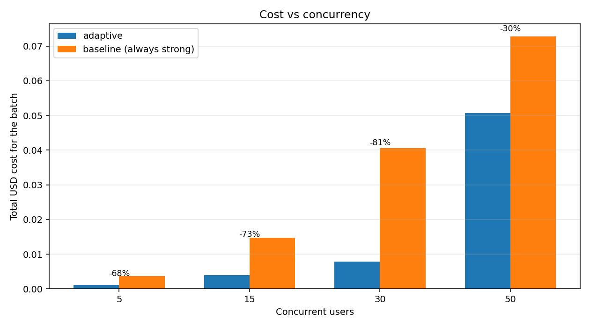
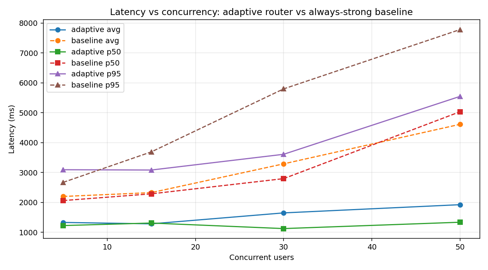
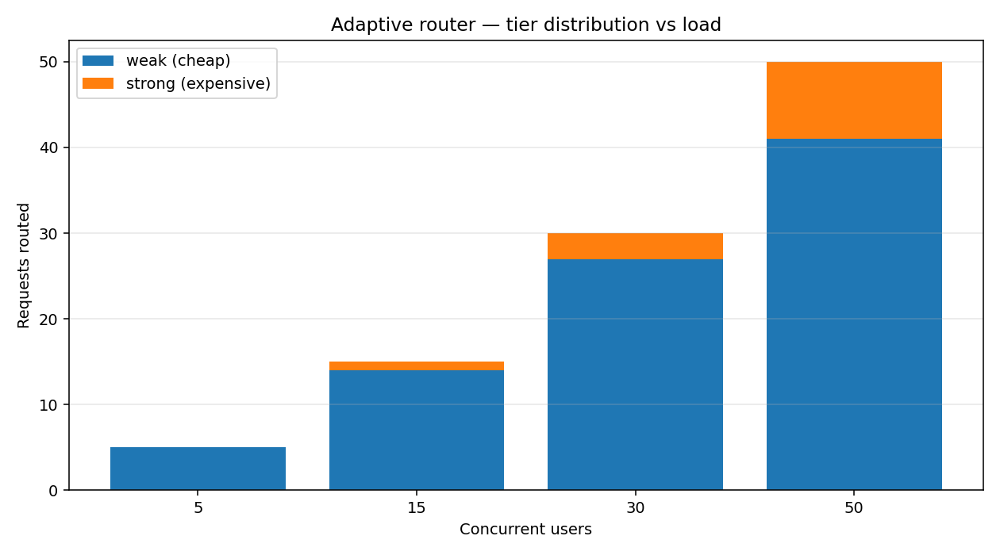

# 🚀 Adaptive RAG Router: Load-Aware, Resilient LLM Gateway


An enterprise-grade, dynamically scaling API gateway for Retrieval-Augmented Generation (RAG) applications. It intercepts user queries, injects semantic context from a local vector database, scores the query's complexity using a local ML model, and intelligently routes the request between a pool of fast/cheap LLMs and a heavy Premium LLM (like GPT-4o). 

Crucially, it features **Stateful Circuit Breakers**, **Dynamic Load-Aware Thresholds**, and **Proactive Rate Limiters** to guarantee 100% uptime during massive concurrency bursts.

*(**Note:** Powered by [LiteLLM](https://github.com/BerriAI/litellm) under the hood, the router is completely provider-agnostic. You can plug in absolutely any paid premium API—OpenAI, Anthropic, AWS Bedrock, etc.—just by changing the model string in your `.env`).*

---

## 🛑 The Production Problem

Building a resilient LLM application in production is fundamentally a battle against three constraints: Cost, Latency, and Rate Limits.

1. **Unnecessary Cost:** Standard applications route every request to a single, heavy model. Users asking simple FAQs cost just as much as users asking complex analytical questions. Furthermore, cheap models often "ramble" and hallucinate when asked simple questions, destroying cost savings.
2. **Tail Latency (p95) Spikes:** Under concurrent load, requests queue up waiting for the heavy model to finish generating. A 50-user burst can easily cause 8+ second wait times for users stuck at the back of the queue.
3. **The API Concurrency Trap:** Free and developer-tier APIs are heavily restricted. Mistral throttles at 1 request-per-second; Gemini caps at ~20 requests per day. Hitting these with concurrent bursts instantly triggers `HTTP 429 Too Many Requests`, crashing standard applications.

---

## 🏗️ System Architecture

```mermaid
%%{init: {'theme': 'base', 'themeVariables': { 'primaryColor': '#ffffff', 'primaryBorderColor': '#333333', 'lineColor': '#c4a1ff'}}}%%
flowchart TB
    classDef user fill:#2a2a2a,stroke:#c4a1ff,stroke-width:2px,color:#fff,rx:15px;
    classDef gateway fill:#212121,stroke:#7dd3a8,stroke-width:2px,color:#fff;
    classDef local fill:#212121,stroke:#7cc8e0,stroke-width:2px,color:#fff,stroke-dasharray: 5 5;
    classDef router fill:#333333,stroke:#f0a56c,stroke-width:2px,color:#fff;
    classDef model fill:#2a2a2a,stroke:#ececec,stroke-width:1px,color:#fff,rx:8px;
    classDef db fill:#212121,stroke:#7cc8e0,stroke-width:2px,color:#fff,shape:cylinder;
    classDef shed fill:#f07070,stroke:#333,stroke-width:2px,color:#fff;

    Client([👤 User / Web Client]):::user -->|POST /chat| API[⚡ FastAPI Gateway]:::gateway
    
    subgraph Local Inference & Context
        API --> RAG[(📚 ChromaDB + MiniLM)]:::db
        RAG -->|Retrieves Context| API
        API --> Classifier[🧠 DistilBERT Scorer]:::local
        API --> Tracker[📊 Active Load Tracker]:::local
        API --> RateLimiter[⏱️ Provider API Tracker]:::local
    end
    
    Classifier -.->|Base Score 0.0-1.0| DecisionEngine{🔄 Adaptive Router}:::router
    Tracker -.->|In-Flight Count| DecisionEngine
    RateLimiter -.->|Live RPM Budgets| DecisionEngine
    API ==>|Route Query| DecisionEngine
    
    DecisionEngine -- "Adjusted Score < 0.55\n(Simple)" --> WeakPool
    DecisionEngine -- "Adjusted Score >= 0.55\nOR Rate Limit Spillover" --> StrongPool
    DecisionEngine -- "Active Load > 35\n(Congestion)" --> Drop[🚫 HTTP 429\nFail-Fast Load Shed]:::shed
    
    subgraph WeakPool [Weak Tier Pool (High Concurrency)]
        direction TB
        Groq[🟢 Groq 20B\nPrimary Workhorse\n30 RPM]:::model
        Gem[🟡 Gemini Flash\nFallback]:::model
        Mis[🟠 Mistral Small\nFallback\n1 Req/Sec]:::model
        Groq -. "Circuit Breaker" .-> Gem -. "Circuit Breaker" .-> Mis
    end
    
    subgraph StrongPool [Strong Tier (Deep Reasoning)]
        direction TB
        Premium[🔵 Premium LLM\nGPT-4o / Claude 3.5]:::model
    end
```

---

## 🧠 Deep Dive: Engineering & Design Choices

This project was built from the ground up to solve edge-case concurrency failures. Here are the core architectural decisions implemented in the codebase:

### 1. Local DistilBERT Classification (Zero-Cost Routing)
Many "adaptive" frameworks use an LLM (like GPT-3.5) to decide if a prompt is complex enough for GPT-4. This doubles latency and API costs. This architecture uses a locally hosted, fine-tuned **DistilBERT** pipeline (`app/classifier.py`) to score prompt complexity semantically in less than 20 milliseconds, for free.

### 2. Local Vector RAG Injection
Before classification occurs, the user's prompt is embedded using a local `sentence-transformers/all-MiniLM-L6-v2` model. The `app/rag.py` module queries a persistent **ChromaDB** vector store to retrieve top-K relevant documents. The context is injected into the prompt so the LLM has grounded knowledge.

### 3. Dynamic Load-Aware Thresholding
The router (`app/router.py`) does not use static rules. The base complexity threshold is `0.55`. However, the `load_tracker.py` constantly monitors active in-flight requests. If the server detects a high-load burst (e.g., >70% capacity), the router **dynamically raises the threshold** to `0.70` or `0.85`. This forces the system to aggressively shed marginal traffic to the cheap/fast tier to survive the spike.

### 4. Proactive Org-Aware Rate Limiting
APIs like Groq enforce strict 30 RPM limits *across the entire organization*. The `rate_limiter.py` module tracks timestamps in a `deque` to calculate exact remaining budgets locally. Instead of waiting to be rejected by the API, the system knows exactly when its 30 requests are up and stops sending traffic to Groq.

### 5. Weighted Fallback Pools & Spillover
If Groq hits its 30 RPM limit, the Weak Tier relies on a weighted lottery (`_call_pool` in `llm_client.py`). It seamlessly spills remaining requests over to Gemini and Mistral, perfectly utilizing their heavily-throttled limits. If the *entire* Weak Tier is exhausted, the router overrides DistilBERT and spills simple queries to the Strong Tier to guarantee 100% uptime.

### 6. Stateful Circuit Breakers
If an API provider goes down (or aggressively rate-limits), standard applications will repeatedly wait 10 seconds for a timeout, hanging the client. The `circuit_breaker.py` implements a state machine (Closed -> Open -> Half-Open). If a model fails 5 times, the breaker trips, and the router instantly removes that model from the pool for 30 seconds, preventing cascading failures.

### 7. p95 Latency Protection (Fail-Fast Backpressure)
If the Premium LLM (Strong Tier) becomes severely congested (>35 active connections), queuing new requests will cause massive 8-second tail latencies. The router prevents this by instantly returning a `429 Too Many Requests`. This Fail-Fast backpressure forces clients to retry later rather than hanging indefinitely.

### 8. Tiered Output Caps & Persona Engineering
Cheap models often hallucinate or output overly verbose answers for simple questions, inflating token costs. To solve this, `llm_client.py` dynamically injects behavioral system prompts (*"You are a concise assistant. Answer in 1-3 sentences maximum."*) and enforces a strict `max_tokens=150` generation cap exclusively on the Weak Tier.

---

## 📊 Evaluation & Results

The repository includes a custom concurrent async simulator (`eval/load_test.py`) that fires 50 concurrent requests. It compares the Adaptive Router against a **Naive Baseline** (which sends 100% of traffic to the Premium LLM). 

Tested on a dataset of 50 unique RAG/HR prompts, the **routing classification accuracy was 96.0%**.

### 1. Cost Reduction (-81%)

By identifying simple traffic, routing to the Weak Tier, and enforcing strict token caps, operational cost plummeted from **$0.0406 to $0.0079 (an 81% reduction)** at N=30 concurrent users.

### 2. Tail Latency Protection (-58%)

In the Baseline test, 50 concurrent requests overwhelmed the Premium LLM's queue. Average latency skyrocketed to 4.6 seconds, and p95 latency nearly hit 8 seconds. The Adaptive Router offloaded 80% of this traffic to blazingly fast Weak instances, processing the burst in **1.9 seconds on average (58% faster)**.

### 3. Absolute Reliability (0% vs 10% Error Rate)

During the N=50 load test:
* **The Baseline (Premium LLM Only):** Dropped 10% of requests (5 failures) because a 50-request burst instantly exceeded the provider's rate limits, causing upstream `429` crashes.
* **The Adaptive Router:** Processed **all 50 requests perfectly (0% error rate)**. As the primary Weak model saturated, the Weighted Fallback Pool seamlessly activated, balancing the remaining traffic across backup APIs.

---

## 📂 Repository Structure

```text
adaptive-rag-router/
├── app/
│   ├── main.py              # FastAPI core, endpoints, and UI serving
│   ├── router.py            # Adaptive routing, Dynamic Thresholds, Spillover
│   ├── classifier.py        # Local DistilBERT pipeline for prompt scoring
│   ├── llm_client.py        # LiteLLM execution, tier management, & token caps
│   ├── rate_limiter.py      # Real-time RPM tracking for providers (e.g., Groq)
│   ├── load_tracker.py      # Semaphore-based in-flight connection tracking
│   ├── circuit_breaker.py   # State machine (Open/Closed) for API resilience
│   └── rag.py               # ChromaDB + SentenceTransformers vector retrieval
├── eval/
│   ├── load_test.py         # Concurrent async load simulator (N=5 to N=50)
│   ├── plot_results.py      # Auto-generates matplotlib evaluation charts
│   └── labeled_prompts.json # 50 hand-crafted evaluation prompts (80/20 mix)
├── static/
│   └── index.html           # Custom HTML/JS chat dashboard with live system stats
├── training/                # Scripts and notebooks for fine-tuning DistilBERT
├── config.py                # Centralized environment vars and safe defaults
└── requirements.txt         
```

---

## 🚀 Getting Started

### 1. Installation
Clone the repository and install the dependencies:
```bash
git clone https://github.com/RaghavK24/adaptive-rag-router.git
cd adaptive-rag-router
python3 -m venv venv
source venv/bin/activate
pip install -r requirements.txt
```

### 2. Environment Setup
Create a `.env` file in the root directory. You can plug in any APIs supported by LiteLLM:
```env
# Premium Tier (Strong)
OPENAI_API_KEY=your_openai_key
# Or use ANTHROPIC_API_KEY=your_anthropic_key
STRONG_MODEL=openai/gpt-4o

# Weak Tier (Fast/Cheap)
GROQ_API_KEY=your_groq_key
GEMINI_API_KEY=your_gemini_key
MISTRAL_API_KEY=your_mistral_key

WEAK_MODEL=groq/openai/gpt-oss-20b
MAX_CONCURRENT_REQUESTS=50
```

### 3. Running the Server
Start the FastAPI server:
```bash
uvicorn app.main:app --port 8000
```
Open your browser to **`http://localhost:8000`**. The custom UI includes a live telemetry dashboard that monitors server load, active circuit breakers, and API budget consumption in real-time as you chat.

---

## 🧪 Running the Load Test
To recreate the evaluation graphs locally, start the server in one terminal, then run the load simulator in another:

```bash
# Fire a concurrent burst of N=5, 15, 30, and 50 users
python -m eval.load_test --levels 5 15 30 50

# Generate the matplotlib charts and summary markdown
python -m eval.plot_results
```
